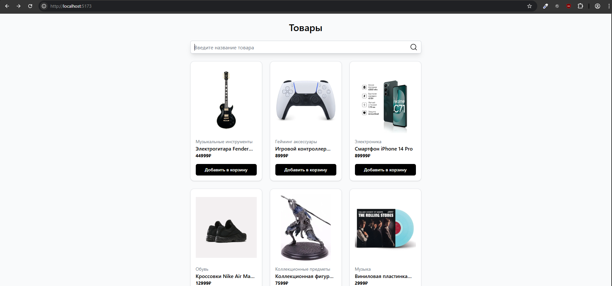
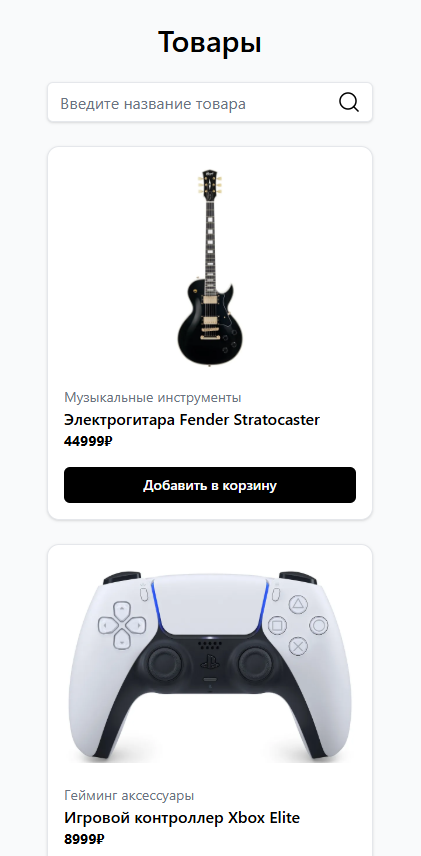
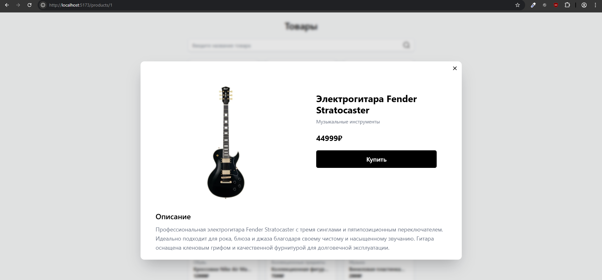
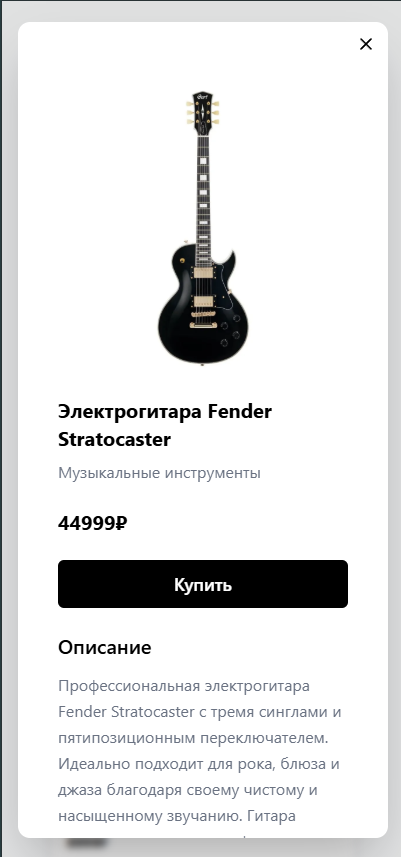

# Тестовое задание React + TypeScript + Vite + Tailwind

MainPage - главная (домашняя) страница, выводит карточки товаров, также позволяет сортировать товары по названию с помощью компонента SearchBar, товары загружаются через отдельный хук `useProductSearch` который принимает Search запрос, также реализован debouncing input. Список полученных товаров отрисовывается через `grid` в зависимости от размера экрана меняется количество колонок в списке товаров.

ProductCard - отображает минимальную информацию о товаре, также по клику открывает модальное окно с полной информацией о товаре

`Modal` - компонент обертка, отрисовывает любой переданный Children как модальное окно работает на `createPortal`, реализует подход _modal routes_, при открытии модального окна меняется маршрут, при закрытии окна ссылка сайт возвращается на предыдущую страницу. Также страницу товара можно открыть как обычное окно.

Стилизация реализованна на Tailwind css

Данные о товарах хранятся в lib/mockdata.json. Также Реализованны функции `getProductsData` для получения списка товаров и `getProductById` для получения одного товара по его id

